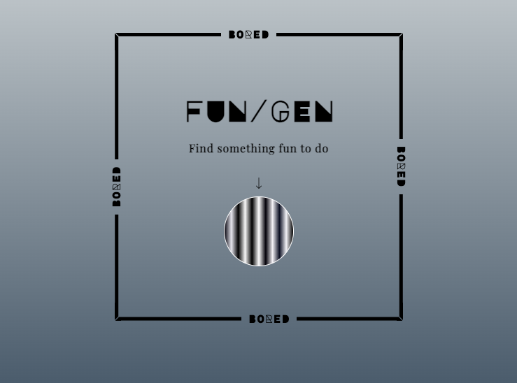

<!-- ABOUT THE PROJECT -->
<h1 align="center">Activity Generator</h1>
<h3 align="center">- the BoredBot API APP Challenge from Scrimba, Developed by Me</h3>

&nbsp;

Welcome to the Activity Generator project - a web application that helps you discover new ideas for activities with just a click of a button. The project originated from an API challenge on the Scrimba learning platform and I have further developed its UX and UI. The web app utilizes the BoredBot API to fetch activities and presents them with animations that enhance user experience and visually guide the user to their next engagement. The application is designed with user-friendly and accessible navigation, inviting individuals to discover activities with ease.

The Activity Generator is incredibly easy to use. To get started, simply open the application in your preferred web browser and click the button located at the centre of the screen. As soon as you click the button, it will start spinning, indicating that something exciting is about to happen. Within seconds, the application will present you with an activity from BoredBot, accompanied by a dynamic display of animations and changing texts. You can keep clicking the button to explore a wide range of exciting activities.

&nbsp;

### Built With

    
    
    
    

&nbsp;

## Features

    
 

Simple and User-Friendly Interface
The Activity Generator has a simple and easy-to-use interface, which allows users to easily discover new activities. Its clean layout and prominently displayed button make it user-friendly and cater to individuals seeking a quick and straightforward way to find engaging activities.

Dynamic Content Rendering
Activity Generator's core functionality lies in its ability to dynamically retrieve and display content using the BoredBot API. The app utilises modern browser API features to fetch new activity suggestions in real time as users interact with it. This demonstrates proficient integration with external APIs to seamlessly render dynamic content.

CSS Animations
The Activity Generator utilizes CSS animations to elevate user engagement and provide an interactive user interface. The dynamic animations are prominently displayed in three main areas: the constant-motion legend element, a spinning effect applied to the button when clicked, and a pulsating glow effect that highlights the activity text. CSS animations improve the user interface's visual appeal and interactive nature.

(<a href="#readme-top">back to top</a>)

&nbsp;

## Feedback & Licensing

I welcome any feedback, suggestions for improvement, or code corrections you may have. Feel free to reach out to me by creating an issue, a pull request, or contacting me on [LinkedIn](https://www.linkedin.com/in/laila-kelloniemi). I look forward to hearing from you!

Distributed under the MIT License. See `LICENSE.txt` for more information.

(<a href="#readme-top">back to top</a>)

&nbsp;

## Contact

+ Project Link:   
+ Activity Generator url:   
+ [Laila Kelloniemi Github profile](https://github.com/laila-kelloniemi)   
+ [LinkedIn](https://www.linkedin.com/in/laila-kelloniemi)   

(<a href="#readme-top">back to top</a>)

&nbsp;

## Acknowledgments

+ [BoredBot API](https://www.boredapi.com/)
+ [Scrimba](https://scrimba.com/)  
+ [Netlify](https://www.netlify.com/)

(<a href="#readme-top">back to top</a>)

&nbsp;

# Scrimba's Original Twimba Readme.md

&nbsp;

## About Scrimba

At Scrimba our goal is to create the best possible coding school at the cost of a gym membership! 💜
If we succeed with this, it will give anyone who wants to become a software developer a realistic shot at succeeding, regardless of where they live and the size of their wallets 🎉
The Frontend Developer Career Path aims to teach you everything you need to become a Junior Developer, or you could take a deep-dive with one of our advanced courses 🚀

- [Our courses](https://scrimba.com/allcourses)
- [The Frontend Career Path](https://scrimba.com/learn/frontend)
- [Become a Scrimba Pro member](https://scrimba.com/pricing)

Happy Coding!
